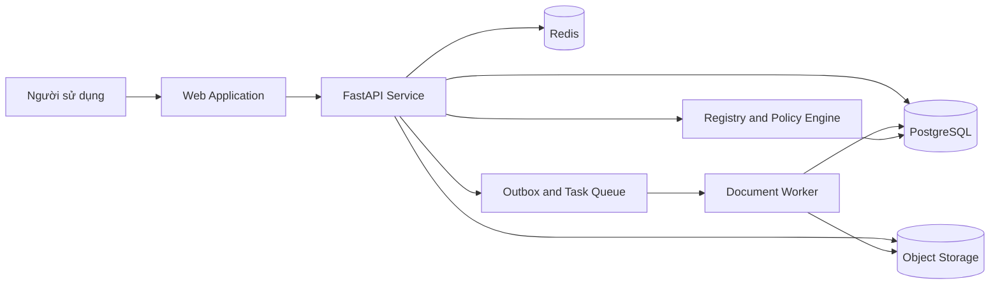
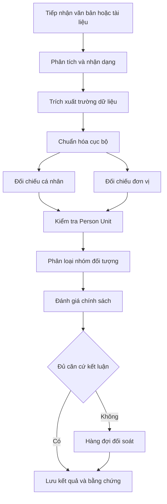
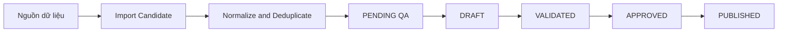

# CA BQP Verification Platform

## Tổng quan

CA BQP Verification Platform là nền tảng nội bộ phục vụ tiếp nhận hồ sơ, trích xuất thông tin đối tượng, đối chiếu đơn vị công tác và hỗ trợ đánh giá phạm vi quản lý của Bộ Công an và Bộ Quốc phòng.

Hệ thống được thiết kế theo nguyên tắc lấy bằng chứng làm cơ sở, ưu tiên dữ liệu danh mục đã được phê duyệt và không tự động kết luận khi thông tin chưa đủ độ tin cậy. Mọi kết quả nghiệp vụ đều lưu nguồn dữ liệu, bằng chứng, độ tin cậy và phiên bản cấu hình để phục vụ kiểm tra và tái hiện quyết định.

## Phạm vi chức năng

Phiên bản hiện tại cung cấp các nhóm chức năng sau:

- Tra cứu bằng biểu mẫu có cấu trúc hoặc nội dung văn bản tự do.
- Tiếp nhận PDF, DOCX, XLSX, XLS, PNG, JPG, JPEG, TXT và CSV.
- Nhận dạng tài liệu bằng EasyOCR và sử dụng VietOCR khi kết quả nhận dạng chính không đạt ngưỡng chất lượng.
- Trích xuất họ tên, mã định danh, năm sinh, chức vụ, đơn vị hiện tại và đơn vị từng công tác.
- Chuẩn hóa văn bản tiếng Việt có dấu, không dấu, chữ hoa và chữ thường bằng thuật toán cục bộ.
- Đối chiếu độc lập cá nhân và đơn vị, sau đó kiểm tra tính nhất quán giữa hồ sơ nhân sự và đơn vị do người dùng cung cấp.
- Phân biệt thông tin hiện tại, thông tin lịch sử và câu phủ định trước khi phân loại nhóm đối tượng.
- Đối chiếu Master Unit Registry và xác định BCA, BQP, OTHER hoặc UNKNOWN.
- Đánh giá chính sách theo phiên bản và chuyển hồ sơ thiếu căn cứ sang hàng đợi đối soát.
- Tìm kiếm hàng đợi theo tên hoặc mã hồ sơ, lọc theo ngày, phân công và ghi nhận quyết định.
- Quản trị danh mục, tài khoản, phân quyền, nhật ký kiểm toán và dữ liệu nhập theo lô.

## Nguyên tắc nghiệp vụ

- NOT_FOUND không đồng nghĩa với OTHER.
- Đơn vị thuộc BCA hoặc BQP không tự động chứng minh một cá nhân thuộc nhóm CAND hoặc quân nhân.
- Hồ sơ có nhiều đơn vị phải xác định đơn vị công tác hiện tại; không lấy đơn vị xuất hiện đầu tiên làm kết luận.
- Cá nhân và đơn vị được đối chiếu độc lập. Kết quả mâu thuẫn phải chuyển đối soát với lý do cụ thể.
- Vai trò trong quá khứ hoặc câu phủ định không được xem là bằng chứng về trạng thái công tác hiện tại.
- Chính sách thiếu trường bắt buộc phải trả về INSUFFICIENT_DATA.
- Kết quả không đủ độ tin cậy phải dừng tại Human Review thay vì tự động suy đoán.
- Hiệu đính của cán bộ không tự động trở thành bí danh chính thức trong danh mục.
- Danh mục đã công bố là bất biến; rollback tạo phiên bản mới thay vì sửa lịch sử.

## Kiến trúc hệ thống



Hệ thống hỗ trợ hai cấu hình vận hành dùng chung mã nguồn:

- Local profile sử dụng PostgreSQL, lưu tài liệu trên hệ thống tệp và xử lý hàng đợi trong tiến trình ứng dụng.
- Docker profile sử dụng PostgreSQL, Redis, MinIO, Celery Worker, ClamAV, Prometheus và Nginx.

## Luồng xử lý nghiệp vụ



## Tra cứu văn bản tự do

Luồng tra cứu tự do hiện tại được xử lý hoàn toàn bằng thuật toán cục bộ:

1. Nhận diện nhãn và cấu trúc câu theo tập luật nghiệp vụ.
2. Chuẩn hóa bản sao phục vụ so khớp bằng cách chuyển chữ thường và loại bỏ khác biệt dấu tiếng Việt.
3. Giữ nguyên chuỗi gốc trong dữ liệu bằng chứng và giao diện.
4. Xác định ranh giới giữa họ tên, chức vụ, mã định danh và đơn vị.
5. Phân biệt đơn vị hiện tại với đơn vị trong quá khứ.
6. Phát hiện câu phủ định và trạng thái đã thôi công tác.
7. Chuyển trường hợp không chắc chắn sang đối soát.

Thiết kế này không gửi nội dung hồ sơ tới dịch vụ phân loại bên ngoài.

## Đối chiếu Person và Unit

Person Registry và Master Unit Registry có trách nhiệm độc lập:

- Person Resolver xác định danh tính dựa trên mã định danh, họ tên, năm sinh và dữ liệu nhân sự đã được phê duyệt.
- Unit Resolver xác định đơn vị dựa trên mã đơn vị, tên chuẩn, bí danh và các phương pháp so khớp đã cấu hình.
- Case Service kiểm tra đơn vị trong hồ sơ nhân sự với đơn vị người dùng cung cấp.

Nếu hai nguồn cùng được xác định nhưng trỏ tới hai đơn vị khác nhau, hồ sơ nhận trạng thái NEED_REVIEW, lý do PERSON_UNIT_CONFLICT và độ tin cậy quyết định bằng không.

## Nhận dạng tài liệu

Pipeline OCR của phiên bản này gồm:

1. EasyOCR thực hiện phát hiện vùng chữ và nhận dạng chính.
2. Quality Gate đánh giá độ tin cậy, tỷ lệ ký tự hợp lệ và tính nhất quán của trường định danh.
3. VietOCR được sử dụng khi kết quả EasyOCR không đạt ngưỡng.
4. Hệ thống chọn toàn bộ kết quả của một engine; không ghép ký tự giữa hai engine.
5. Mâu thuẫn ở trường định danh làm Quality Gate thất bại và hồ sơ được chuyển đối soát.

Model và trọng số cần thiết được đóng gói trong quá trình build image. Worker không tải model trong lúc xử lý yêu cầu.

## Hàng đợi đối soát

Hàng đợi cung cấp:

- Tìm kiếm theo họ tên hoặc mã hồ sơ hiển thị.
- Lọc theo ngày gửi thẩm định.
- Hiển thị dữ liệu hiện hành cùng snapshot tại thời điểm chuyển thẩm định.
- Hiển thị tên và mã đơn vị đã nhập, đơn vị từng công tác, đơn vị chuẩn hóa và đơn vị theo hồ sơ nhân sự.
- Phân công theo phạm vi phụ trách.
- Ghi nhận người xử lý, thời điểm, nội dung quyết định và phiên bản bản ghi.
- Cho phép người tra cứu gửi hồ sơ chưa có kết luận vào hàng đợi khi không có quyền phê duyệt.

Quyền xem hàng đợi và quyền ra quyết định được kiểm tra độc lập tại API. Việc ẩn nút trên giao diện không thay thế kiểm soát phân quyền phía máy chủ.

## Bảo mật và quản trị dữ liệu

- Mật khẩu được băm bằng PBKDF2 HMAC SHA256 với salt riêng.
- Phiên đăng nhập sử dụng token ngẫu nhiên và chỉ lưu bản băm tại máy chủ.
- Quyền được đọc lại từ cơ sở dữ liệu ở mỗi request để việc thu hồi có hiệu lực ngay.
- Upload được kiểm tra MIME, magic byte, kích thước giải nén và phần mềm độc hại.
- Nhật ký nghiệp vụ là append only.
- Log kỹ thuật có cơ chế loại bỏ dữ liệu nhạy cảm.
- API hỗ trợ rate limit, security header và giới hạn phạm vi reviewer.
- Secret không được ghi trong repository. Môi trường triển khai phải cung cấp secret qua cơ chế quản lý bí mật của hạ tầng.

## Cấu trúc repository

```text
apps/backend        FastAPI, domain services, workers, migrations and tests
apps/web            React application and browser tests
artifacts           Versioned registry and resolver artifacts
datasets            Curated and sample datasets
docs                Architecture, business analysis and quality documents
ops                 Local operations, monitoring and runbooks
pipelines           Registry and data preparation pipelines
```

## Yêu cầu môi trường

Môi trường phát triển:

- Python 3.11 trở lên.
- Node.js 22 trở lên.
- PostgreSQL 16.
- Conda environment có tên bqp nếu sử dụng lệnh vận hành đi kèm repository.

Môi trường Docker:

- Docker Engine hỗ trợ BuildKit.
- Docker Compose phiên bản 2.
- Tối thiểu 16 GB RAM cho quá trình build đầy đủ các thư viện OCR và model.
- Dung lượng trống phù hợp cho image, model cache, registry và dữ liệu PostgreSQL.

## Khởi động môi trường local

```bash
conda run -n bqp python ops/local.py start
```

Các endpoint mặc định:

- Web Application: http://127.0.0.1:3000
- OpenAPI: http://127.0.0.1:8000/docs
- Readiness: http://127.0.0.1:8000/health/ready

Các lệnh vận hành:

```bash
conda run -n bqp python ops/local.py status
conda run -n bqp python ops/local.py stop
conda run -n bqp python ops/local.py migrate
conda run -n bqp python ops/local.py seed
```

Tài khoản mặc định chỉ dành cho môi trường phát triển và phải được thay đổi trước khi triển khai:

- admin với mật khẩu admin.
- user với mật khẩu user.

## Khởi động bằng Docker Compose

Tạo file môi trường cục bộ từ mẫu và thay toàn bộ credential mặc định:

```bash
cp .env.example .env
docker compose config --quiet
docker compose build backend web
docker compose up -d
docker compose ps
```

Các dịch vụ mặc định:

- Web Application: http://localhost:3000
- OpenAPI: http://localhost:8000/docs
- MinIO Console: http://localhost:9001
- Prometheus: http://localhost:9090

Không commit file `.env`. Không sử dụng credential mặc định tại môi trường kiểm thử tích hợp, staging hoặc production.

## Kiểm thử backend

```bash
cd apps/backend
python -m pip install -e '.[dev]'
pytest -q
ruff check src tests scripts
mypy src
bandit -q -r src
pip-audit --strict
```

## Kiểm thử frontend

```bash
cd apps/web
npm ci --no-audit --no-fund
npm run typecheck
npm run build
npx playwright test
```

## Release gate

Một bản phát hành chỉ được chấp nhận khi hoàn thành các bước sau:

1. Backend tests và golden suites đạt.
2. Ruff, MyPy, Bandit và dependency audit đạt.
3. Frontend typecheck, production build và browser tests đạt.
4. Alembic migration chạy thành công trên cơ sở dữ liệu mới.
5. Docker Compose hợp lệ và backend, worker, web build thành công.
6. Health check của PostgreSQL, Redis, MinIO, ClamAV, backend và worker đạt.
7. Không có secret, credential thật hoặc dữ liệu hồ sơ thật trong commit.
8. SBOM, checksum và provenance của artifact được lưu cùng bản phát hành.

## Registry governance



Crawler và pipeline nhập liệu không ghi trực tiếp vào danh mục đã công bố. Rollback tạo một phiên bản mới từ snapshot đã chọn và giữ nguyên toàn bộ lịch sử.

## Tài liệu vận hành

- `docs/business/INPUT_INTAKE_BUSINESS_ANALYSIS_2026.md`
- `docs/quality/RELEASE_GATES.md`
- `ops/runbooks/BACKUP_RESTORE.md`
- `ops/runbooks/DEPLOY_ROLLBACK.md`
- `ops/runbooks/INCIDENT_RESPONSE.md`
- `ops/runbooks/REGISTRY_POLICY_UPDATE.md`

## Giới hạn triển khai

Repository cung cấp các kiểm soát hướng production nhưng không thay thế quy trình quản trị dữ liệu, quản lý secret, WAF, TLS termination, sao lưu và giám sát của hạ tầng tổ chức. Dữ liệu mô phỏng phải giữ đúng `source_kind` và không được sử dụng như dữ liệu nghiệp vụ chính thức.
